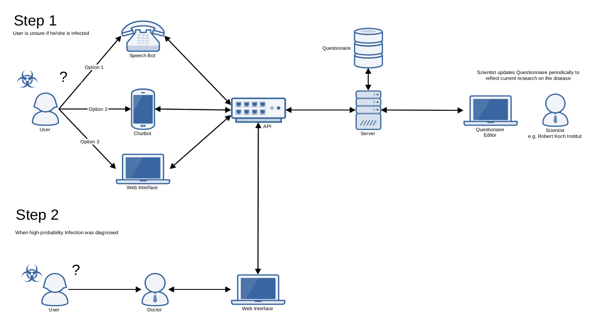

# OpenHeathCheck-Backend

### Problemstellung 

Fragebögen zum Self-Health Check sind auf wenige, meist digitale Medien begrenzt und erfordern beispielsweise einen Internetzugang. Dadurch werden bestimmte Zielgruppen von der Selbstevaluierung ausgeschlossen.

### Zielsetzung 

Wir wollen einen Self-Health Check anbieten, der einheitlich über eine Vielzahl an Medien wie Telefon, Chat, Web und App, angeboten wird.

## Api Documentation
See OpenApi documentation in root folder 

## Limitations of the Project
- Ids in the Backend are guessable

## Getting Started
- In `src/main/resources/application.properties` add your db credentials.
- Create db tables using db/create-db.sql
- Compile using java 13
- Find json editor at: http://localhost:8080/editor/index.html
- Find Api at: http://localhost:8080/api/v1
- Build with maven `mvn clean install`

## Deployment
Build docker container using Dockerfile:
- `docker build -t wirvsvirus-backend .`
- then: `docker container run -p 8080:8080 wirvsvirus-backend`
